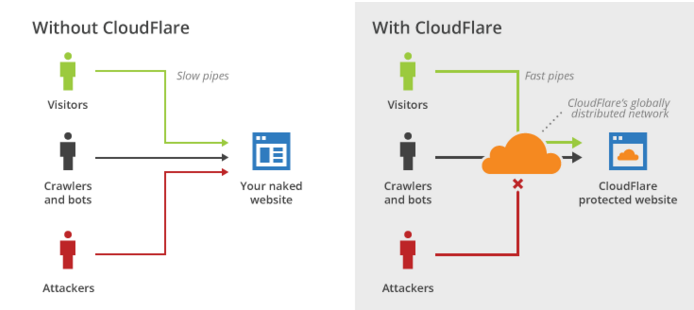
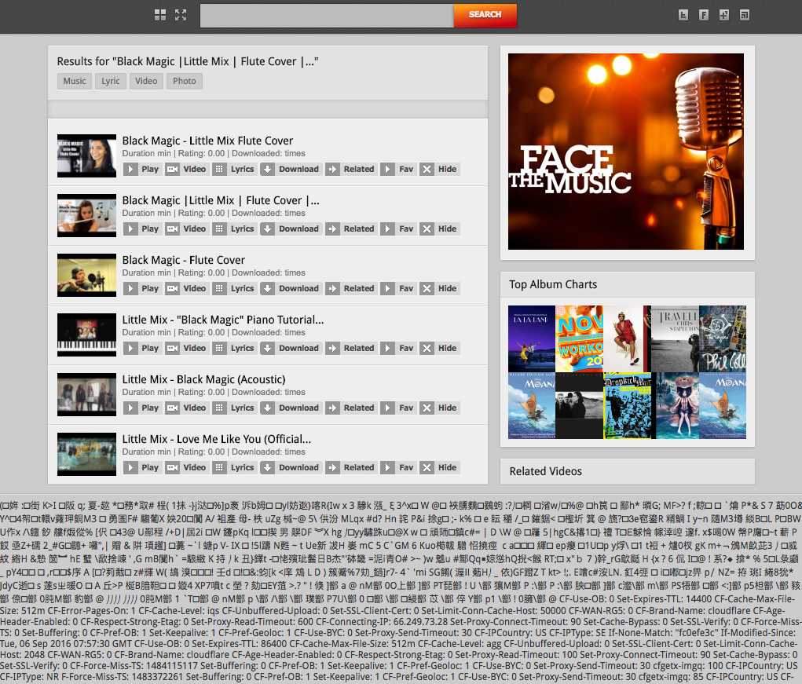

name: inverse
layout: true
class: center, middle, inverse

---

# CloudFlare
## ou *'Ce qui se passa le 23 février #cloudbleed'*

.cloudbleed-img[]

#### https://tikiki.github.io/forma-cloudflare

---

## Mais qu'est-ce que c'est quoi dis-donc
# CloudFlare ?

---
layout: false

.left-column[
## CloudFlare

.cloudflare-logo-img[]
]

.right-column[
  CloudFlare est une entreprise américaine, créée en 2009. Ils proposent des services satellites à un hébergement :

  - CDN (Content Delivery Network)

  - DNS distribué et réseau anycast

  - Reverse proxy

  - Proxy cache

  - Optimisation de sites Web (cache, minification et concaténation de JS, GZIP...)

  - Protection des adresses mail

  - Réécriture des liens en HTTPS

  - Protection DDoS
  
  - Chiffrement SSL
]

---
template: inverse

# Comment ça marche ?

---

.left-column[
## Comment ça marche ?
]
.right-column[
Cloudflare est *entre* votre site et les visiteurs



Navigateur : `nymous.io` ➡ Serveur Cloudflare ➡ Serveur de `nymous.io`

➡ Modification du contenu sur leurs serveurs
]

---
template: inverse

# Les faits
## *Que faisiez-vous le vendredi à 17h54 M. Smith ?*

---
layout: false

.left-column[
## Timelapse
]

---

.left-column[
## Timelapse
### Découverte du problème
]

.right-column[
  - 18/02/2017 0:11 : Tavis Ormandy (chercheur en sécurité chez Google) envoie un tweet à CloudFlare

  .taviso-img[]
]

---

.left-column[
## Timelapse
### Découverte du problème
]

.right-column[

- 18/02/2017 0:11 : Tavis Ormandy (chercheur en sécurité chez Google) envoie un tweet à CloudFlare
]

.right-column-no-padding[
- 18/02/2017 0:32 : Cloudflare reçoit plus d'infos de la part de Google
]

---

.left-column[
## Timelapse
### Découverte du problème
### Recherche de l'origine
]

.right-column[

- 18/02/2017 0:11 : Tavis Ormandy (chercheur en sécurité chez Google) envoie un tweet à CloudFlare
]

.right-column-no-padding[
- 18/02/2017 0:32 : Cloudflare reçoit plus d'infos de la part de Google
]
.right-column-no-padding[
- 18/02/2017 0:40 : Une équipe s'assemble à San Francisco pour rechercher d'où vient le bug
]

--

.right-column-no-padding[
- 18/02/2017 01:19 : Cloudflare découvre que le problème est causé par leur service d'obfuscation d'email ; désactivation mondiale
]

--

.right-column-no-padding[
- 18/02/2017 01:22 : Une équipe se forme à Londres, pour pouvoir travailler en continu
]

--

.right-column-no-padding[
- 18/02/2017 04:24 : Cloudflare découvre que le problème apparait aussi à cause de la réécriture automatique des liens en HTTPS ; désactivation mondiale
]

---
.left-column[
## Timelapse
### Découverte du problème
### Recherche de l'origine
### Déploiement du fix
]

.right-column[
- 18/02/2017 7:22 : Cloudflare découvre la vraie origine du problème (le cf-parser) ; rédaction d'un patch pour le désactiver mondialement
]

--

.right-column-no-padding[
- 20/02/2017 21:59 : Cloudflare déploie le bugfix pour leur cf-parser
]

--

.right-column-no-padding[
- 21/02/2017 18:03 : Tous les services qui avaient été désactivés sont relancés
]

--

.right-column[]
.right-column[]
.right-column[]
.right-column[]
.right-column[]

.right-column[
- Réaction et fix rapide de Cloudflare, déployé sur toute leur infrastructure instantanément

- Travail en collaboration avec les moteurs de recherche (Google, Bing, DuckDuckGo) pour retirer des caches les résultats dangereux
]
---
template: inverse

# D'où venait le problème ?

---

.left-column[
## Comment ?
]

.right-column[
Pour la plupart de leurs services, Cloudflare doit parser la page

➡ Développement de leur propre parseur avec Ragel

```c
/* generated code */
*if ( ++p == pe )
  goto _test_eof;
```

➡ Le pointeur `p` peut sauter après la fin du fichier ! ➡ buffer overrun

Ça arrive si une page finit avec un tag cassé (e.g. `<script type=`) ➡ 0.06% des sites

Mise en place des fonctionnalités buggées :

  - 22/09/2016 : Réécriture HTTP -> HTTPS
  - 30/01/2017 : Server-side excludes
  - 13/02/2017 : Obfuscation des adresses mails


  - 18/02/2017 : Google contacte Cloudflare, la faille est bouchée
]

---

.left-column[
## Comment ?
## Conséquences
]

.right-column[
- Accès à des zones mémoires non prévues

- Injection dans les pages web de données provenant de la RAM des serveurs Cloudflare

.example-leak-img[]
]

---

.left-column[
## Comment ?
## Conséquences
]

.right-column[
- Possible que des mots de passe destinés à Discord se soient retrouvés sur les pages de AshleyMadison

- Idem pour des clés d'API, des tokens d'identification, des cookies d'authentification, des messages d'un chat...

- Les clés SSH/SSL des clients n'ont **pas** fuité (elles étaient dans la RAM d'un autre processus)

- Autre problème : Google a un cache des pages qu'il indexe ➡ même une fois corrigé, le bug est toujours exploitable
]
---

.left-column[
## Comment ?
## Conséquences
## Victimes
]

.right-column[
Potentiellement tous les utilisateurs de sites utilisant Cloudflare

Quelques exemples :

- Coinbase
- Patron
- Hacker News
- Medium
- 4chan
- Yelp
- Uber
- Discord
- Curse
- NY Times
- Pastebin
- Feedly
- ...
]
---
template: inverse

# Pourquoi autant de bordel ?

---
layout: false

.left-column[
## Impact
]

.right-column[
- Cloudflare est *très* utilisé
  - Un nombre énorme de sites potentiellement touchés (estimation haute de 4.287.625 domaines)
]

--

.right-column[
- Comment Cloudflare a accès à tout ça ? Et le trafic chiffré avec HTTPS ?
  - Cloudflare **doit** pouvoir déchiffrer pour appliquer sa "magie"
  - Votre server ⬅ 🔒 ➡ Entrée de Cloudflare ⬅ 🔓 ➡ Magie de Cloudflare ⬅ 🔓 ➡ Sortie de CloudFlare ⬅ 🔒 ➡ Navigateur du client
]

--

.right-column[
- Les mots de passe ne sont pas hashés ?
  - Les mots de passe sont effectivement hashés *dans la base de donnée*...
  - ...*mais* ils sont transmis en clair quand l'utilisateur les tape dans son navigateur
  - Comme Cloudflare est au milieu, il déchiffre le trafic et stocke le mot de passe en RAM
  - Le buffer overrun affiche le mot de passe sur une autre page
]

---
template: inverse

# Le problème Cloudflare

---
layout: false

.left-column[
## Problème Cloudflare
]

.right-column[
- MitM (Man in the Middle)
  - Déchiffrement
  - Espionnage
  - Usage malicieux


- SPoF (Single Point of Failure)

- Faux sentiment de sécurité
]

---
template: inverse

# The end

### https://tikiki.github.io/forma-cloudflare
