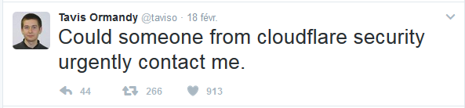

name: inverse
layout: true
class: center, middle, inverse

---

# CloudFlare
## ou *'Ce qui se passa le 23 février #cloudbleed'*

.cloudbleed-img[]

---

## Mais qu'est-ce que c'est quoi dis-donc
# CloudFlare ?

---
layout: false

.left-column[
  ## CloudFlare

  .cloudflare-logo-img[]
]

.right-column[
  CloudFlare est une entreprise américaine, créée en 2009. Ils proposent des services satellites à un hébergement :

  - CDN (Content Delivery Network)

  - DNS distribué et réseau anycast

  - Reverse proxy

  - Proxy cache

  - Optimisation de sites Web (cache, minification et concaténation de JS, GZIP...)

  - Protection DDoS
  
  - Chiffrement SSL
]

---
template: inverse

# Les faits

---
layout: false

.left-column[
  ## Les faits
]

.right-column[
  - 18/02/2017 0:11 : Tavis Ormandy (chercheur en sécurité chez Google) envoie un tweet à CloudFlare

  .taviso-img[]
]

---

.left-column[
  ## Les faits
]

.right-column[

- 18/02/2017 0:11 : Tavis Ormandy (chercheur en sécurité chez Google) envoie un tweet à CloudFlare
]

.right-column-no-padding[
- 18/02/2017 0:32 : Cloudflare reçoit plus d'infos de la part de Google
]

--

.right-column-no-padding[
- 18/02/2017 0:40 : Une équipe s'assemble à San Francisco pour rechercher d'où vient le bug
]

--

.right-column-no-padding[
- 18/02/2017 01:19 : Cloudflare découvre que le problème est causé par leur service d'obfuscation d'email ; désactivation mondiale
]

--

.right-column-no-padding[
- 18/02/2017 01:22 : Une équipe se forme à Londres, pour pouvoir travailler en continu
]

--

.right-column-no-padding[
- 18/02/2017 04:24 : Cloudflare découvre que le problème apparait aussi à cause de la réécriture automatique des liens en HTTPS ; désactivation mondiale
]

---
.left-column[
## Les faits
]

.right-column[
- 18/02/2017 7:22 : Cloudflare découvre la vraie origine du problème (le cf-parser) ; désactivation mondiale
]

--

.right-column-no-padding[
- 20/02/2017 21:59 : Cloudflare déploie le bugfix pour leur cf-parser
]

--

.right-column-no-padding[
- 21/02/2017 18:03 : Tous les services qui avaient été désactivés sont relancés
]

---

---

Pourquoi c'était aussi widespread ?
Pourquoi ils ont accès à ces données ?
Les mots de passe hashés ?
